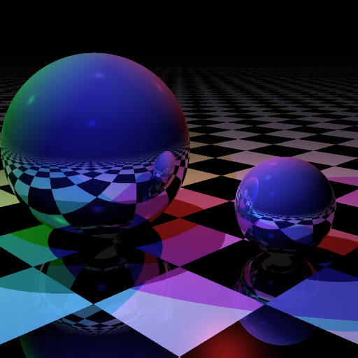

# C++17 `constexpr` Compile-time Ray Tracer #



## Introduction ##

This is a C++17 ray tracer using `constexpr` function evaluation to produce the above image *entirely at compile-time*. Unlike other compile-time ray tracers which use template metaprogramming, this code also works just as well (in fact, thousands of times faster) at run time.

It is based on [Microsoft's TypeScript ray tracer example](https://github.com/Microsoft/TypeScriptSamples/tree/master/raytracer), translated almost line-for-line into C++.

## Requirements ##

This code requires a recent compiler with good support for the upcoming C++17 standard. It works with Clang 4.0 and GCC 7.1 (though see the note below regarding the latter). For MSVC 2017, the code works at run-time (with certain workarounds for unsupported C++17 features, see the [msvc branch](https://github.com/tcbrindle/raytracer.hpp/tree/msvc)), but compile-time evaluation currently hits an ICE.

---

**WARNING**

While compile-time image generation works with GCC 7, compiler memory usage is **extreme** -- tens of gigabytes for even modest image sizes. If you want to try it out with GCC, stick to very small images or prepare for violent retribution from the OOM-killer.

(I believe this is because GCC [memoizes the result](https://gcc.gnu.org/ml/gcc-patches/2009-11/msg01504.html) of every single intermediate `constexpr` evaluation, rather than because of any sort of memory leak -- in other words, this seems to be intended behaviour rather than a bug.)

---

With Clang, you'll need to use the `-fconstexpr-steps` parameter to increase the maximum permitted number of constexpr evaluations in order to generate compile-time images. The included CMake project sets this to the maximum allowed value (2^31-1), which is sufficient to generate an 800x800 pixel image but not much larger.

## Brief implementation overview ##

The `rt::ray_tracer` class takes a **`Scene`** and renders it onto a **`Canvas`**, where both `Scene` and `Canvas` are template parameters given to the `ray_tracer::render()` method. A `Scene` is made up of a number of "things", a number of `light`s, and a `camera`. In the language of the Concepts TS, the expected interface might be something like this:

```cpp
template <typename S>
concept bool Scene() {
    return requires(const S& scene) {
        { scene.get_things() } -> Range<rt::any_thing>;
        { scene.get_lights() } -> Range<rt::light>;
        { scene.get_camera() } -> rt::camera;
    };
}
```

A `Canvas` is simpler, and basically just requires a `set_pixel(x, y, rt::color)` method. The file `compile_time.cpp` contains a scene (and canvas) using `std::array`s, while `run_time.cpp` is the same but uses `std::vector`s instead (to deliberately prevent compile-time evauation).

A **`Thing`** is an object in the world. The header provides two types of `Thing`, namely a `sphere` and a `plane`. To avoid virtual functions, these are used polymorphically via an `any_thing` class, which is a wrapper around a `std::variant<sphere, plane>`. If you wish to define your own kind of `Thing` in a scene (for example a box), you'll need add it to the `any_thing` variant, and implement three member functions: `intersect()`, which tests whether a given ray interects with the Thing, `get_normal()` which returns the normal vector to the object at the given point, and `get_surface()` which returns the `surface` the object is made from. (Unfortunately, the interface for `intersect()` is slightly complicated by the need to return a pointer to an `any_thing` along with the intersection information, but it's fairly straightforward -- take a look at the code for the `sphere` and `plane` classes.)

## Files ##

**raytracer.hpp** is the bit which contains all the magic. As mentioned above, the implementation is that from Microsoft's TypeScript examples set, translated almost exactly into C++.

**stb_image_write.h** is one of Sean Barratt's excellent [single-header C libraries](https://github.com/nothings/stb). It's used for writing out PNGs in `compile_time.cpp` and `run_time.cpp`.

**stb_image_write.c** is the implementation file for the above.

**compile_time.cpp** contains a static description of a scene, which is then rendered into a `constexpr` `std::array`. The image size can be changed using the `IMAGE_WIDTH` and `IMAGE_HEIGHT` compiler defines. For larger image sizes, this will take a *long* time to compile. The upper image size is limited by (a) the amount of RAM on your system with GCC, or (b) the constexpr step limit with Clang, or (c) your patience. Outputs a file called `render-ct.png`.
 
 **run_time.cpp** is almost identical to the above, except that the scene data is contained in run-time data structure,
and the image is rendered into a `std::vector`. Rather than compile-time parameters, you can change the image size by providing command-line arguments to the generated program, e.g. `renderer-rt 1024 1024` for a 1024x1024 image. Outputs a file called `render-rt.png`.

**CMakeLists.txt** contains a CMake project which builds the two targets listed above, as well as taking care of setting things like compiler flags for you.

## Performance ##

Generating the above 512x512 image at compile time took around 45 minutes with Clang 4.0 on my Macbook Pro. For comparison, the same code executing at run time takes less than half a second on the same machine, or somewhere in the region  of 6000x faster.

Believe it or not, this is actually decent performance compared to compile-time raytracers which use template metaprogramming.

## Licence ##

The [original TypeScript version](https://github.com/Microsoft/TypeScriptSamples/issues/143) and this C++ translation are licenced under the Apache-2.0 licence.